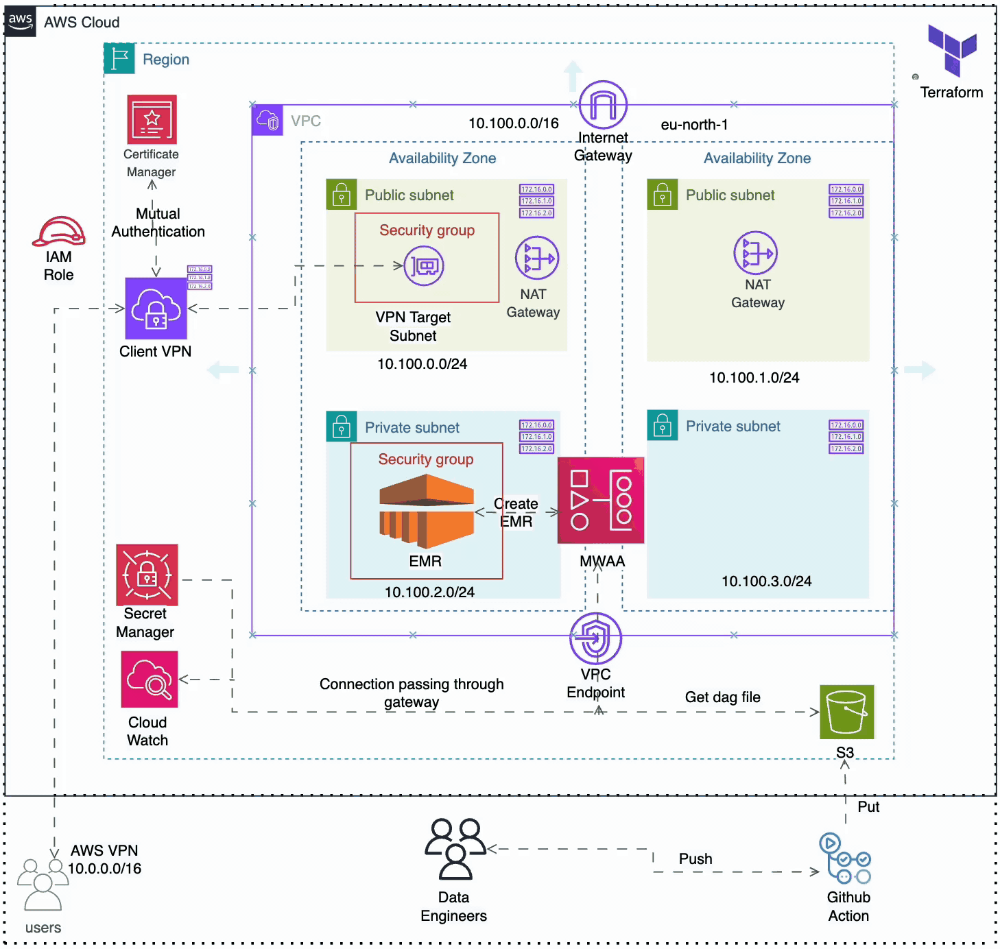

# Big Data Processing Platform

## Background

BuildItAll, a European consulting firm specializing in scalable data platform solutions for small-size companies, recently secured €20M in Series A funding. This milestone strengthens their position in delivering enterprise-grade data platform services.

In early 2024, a Belgian client approached BuildItAll with a critical need: they needed a robust data platform to handle their massive daily data generation and enable data-driven decision-making through big data analytics.

Our team at BuildItAll took on this challenge as our first major project post-funding. The goal was to create a production-ready Big Data Processing Platform using Apache Spark, with a focus on cost optimization while maintaining enterprise-grade capabilities.

## Team

### Core Development Team
- **Ifeanyi** - Analytics Engineer ([GitHub](https://github.com/ioaviator))
- **Taiwo** - Data Engineer ([GitHub](https://github.com/Tee-works))
- **Chidera** - Data Infrastructure Engineer ([GitHub](https://github.com/Chideraozigbo))


## Table of Contents
1. [Project Overview](#project-overview)
2. [Architecture](#architecture)
3. [Infrastructure as Code](#infrastructure-as-code)
4. [AWS Services Used](#aws-services-used)
5. [Security Implementation](#security-implementation)
6. [Data Processing Pipeline](#data-processing-pipeline)
7. [Setup and Installation](#setup-and-installation)
8. [Monitoring and Logging](#monitoring-and-logging)
9. [Cost Optimization](#cost-optimization)
10. [Best Practices](#best-practices)
11. [Troubleshooting](#troubleshooting)
12. [Contributing](#contributing)
13. [Key Takeaways](#key-takeaways)
14. [Resources and Documentations](#resources-and-documentations)

## Project Overview

This project implements a scalable Big Data Processing Platform for BuildItAll's Belgian client. The platform enables big data analytics through Apache Spark workloads, featuring automated cluster management, cost optimization, and robust CI/CD practices.

### Business Context
- **Client**: BuildItAll Consulting (European Consulting Firm)
- **Funding**: €20M Series A
- **Target**: Small-size companies requiring scalable data platforms
- **First Client**: Belgian company requiring big data analytics capabilities

### Key Features
- Fully versioned, controlled codebase
- Automated Apache Spark cluster management
- Cost-optimized infrastructure
- Comprehensive CI/CD pipeline
- Synthetic data generation for testing
- Production-grade security and monitoring

## Architecture

### Infrastructure Overview

The platform is built on AWS Cloud with a focus on security, scalability, and cost optimization. The architecture follows AWS best practices and implements a multi-AZ design for high availability.



### Airflow DAGs

The platform uses Apache Airflow (MWAA) to orchestrate data processing workflows. Two main DAGs are implemented:

### 1. Simple Addition DAG (`test.py`)
A basic DAG that demonstrates the platform's workflow capabilities:
- **Purpose**: Demonstrates basic task execution and dependency management
- **Schedule**: Runs daily
- **Tasks**:
  - `start`: Initial dummy task
  - `addition_task`: Performs a simple addition operation (5 + 3)
  - `end`: Final dummy task
- **Features**:
  - Email notifications on success/failure
  - Automatic retry on failure
  - Configurable retry delay

### 2. Big Data Pipeline DAG (`emr.py`)
A production-grade DAG for orchestrating EMR-based data processing:
- **Purpose**: Manages the complete lifecycle of EMR clusters and Spark jobs
- **Schedule**: Runs daily
- **Tasks**:
  - `begin_workflow`: Initial dummy task
  - `create_emr_cluster`: Creates an EMR cluster with specified configuration
  - `check_cluster_ready`: Monitors cluster creation status
  - `submit_spark_application`: Submits Spark job to the cluster
  - `check_submission_status`: Monitors job execution
  - `terminate_emr_cluster`: Terminates the cluster after job completion
  - `end_workflow`: Final dummy task
- **EMR Configuration**:
  - Release: EMR 7.8.0
  - Applications: Hadoop, Spark
  - Instance Types: m5.xlarge
  - Cluster Size: 1 Master + 2 Core nodes
  - Spot instances for cost optimization
- **Features**:
  - Automated cluster lifecycle management
  - Job monitoring and status tracking
  - Email notifications
  - Automatic retry on failure
  - Secure VPC integration

### DAG Management
- DAGs are stored in S3 and automatically synced to MWAA
- Version control through Git
- Configuration as code
- Secure access through VPC endpoints

### Architecture Flow

1. **Data Ingestion Layer**
   - Users connect through AWS Client VPN (10.0.0.0/16)
   - Data Engineers push code through GitHub Actions
   - Data flows through the VPN Gateway into the VPC

2. **Processing Layer**
   - EMR Cluster in private subnet (10.100.2.0/24)
   - MWAA (Managed Workflows for Apache Airflow) for orchestration deployed in the two private subnets for high availability
   - Auto-scaling based on workload
   - NAT Gateways with Elastic IPs for limited internet access (primarily for Airflow email notifications)

3. **Storage Layer**
   - S3 Data Lake with organized structure:
     - `etl/` - For ETL scripts and configurations
     - `dags/` - For Airflow DAG definitions
     - `logs/` - For application and system logs

4. **Security Layer**
   - Used VPC Endpoints to allow private subnet resources to securely access AWS services
   - NAT Gateways for limited internet access
   - IAM roles and policies
   - Security groups 
   - Certificate-based VPN authentication

5. **VPC Endpoints**
   - **S3 Gateway Endpoint**
     - Enables private connectivity to S3 without internet access
     - Reduces data transfer costs
     - Improves security by keeping traffic within AWS network
   
   - **CloudWatch Logs Interface Endpoint**
     - Secure logging without internet access
     - Enables private subnet resources to send logs to CloudWatch
     - Maintains security boundaries while enabling monitoring
   
   - **Secrets Manager Interface Endpoint**
     - Secure access to secrets without internet exposure
     - Enables private subnet resources to retrieve credentials securely
     - Reduces attack surface by eliminating internet access for secrets
   
   - **SQS Interface Endpoint**
     - Enables private communication between services
     - Supports message queuing without internet access
     - Maintains security for inter-service communication
   
   - **EMR Interface Endpoint**
     - Despite EMR being in the VPC, the interface endpoint is crucial for:
       - Secure communication with EMR control plane
       - Private access to EMR API operations
       - Enables cluster management without internet access
       - Supports secure job submission and monitoring
       - Reduces exposure of management operations to the internet
     - Benefits:
       - Enhanced security for cluster management operations
       - Reduced attack surface for EMR control plane
       - Improved reliability by keeping management traffic within AWS network
       - Better compliance with security requirements
       - Cost optimization by reducing NAT Gateway usage for management operations

### Why These Services?

1. **Amazon EMR**
   - Native Spark support
   - Cost-effective with spot instances
   - Automated cluster management
   - Integration with AWS services

2. **MWAA (Managed Workflows for Apache Airflow)**
   - Fully managed orchestration
   - Native AWS integration
   - Scalable and reliable
   - Reduced operational overhead

3. **AWS Client VPN**
   - Secure access to resources
   - Certificate-based authentication
   - Split-tunnel support
   - Detailed connection logging

## Infrastructure as Code

Our infrastructure is managed entirely through Terraform, with modular components for maintainability and reusability.

### Terraform Structure

```
terraform/
├── main.tf              # Main infrastructure definitions
├── variables.tf         # Variable declarations
├── outputs.tf          # Output definitions
├── providers.tf        # Provider configurations
├── backend.tf         # State management configuration
├── certificates/      # VPN certificates
├── policies/         # IAM policies
└── .terraform/       # Terraform plugins and modules
```

### Key Infrastructure Components

1. **Networking (VPC)**
   ```hcl
   module "vpc" {
     cidr_block           = "10.100.0.0/16"
     vpc_name             = "big-data-VPC"
     create_igw           = true
     enable_dns_support   = true
     enable_dns_hostnames = true
   }
   ```

2. **Subnets**
   - VPN Target Subnet: 10.100.0.0/24 (Public)
   - Application Subnet: 10.100.1.0/24 (Public)
   - Private Subnet A: 10.100.3.0/24 (Private)
   - Private Subnet B: 10.100.4.0/24 (Private)

3. **NAT Gateways with Elastic IPs**
   - One NAT Gateway per private subnet for limited internet access
   - Each NAT Gateway associated with an Elastic IP
   - Primarily used for Airflow email notifications
   - Located in public subnets for high availability
   - Provides stable public IP addresses for outbound internet access

4. **Security Groups**
   ```hcl
   module "vpc_private_sg" {
     vpc_id              = module.vpc.vpc_id
     security_group_name = "private-sg"
     description         = "Allow all traffic from VPC"
   }
   ```

4. **IAM Configuration**
   - Service Roles (EMR, MWAA)
   - User Management
   - Policy Attachments

## Data Processing Pipeline

1. **Data Ingestion**
   - Secure data upload through VPN
   - S3 bucket with organized structure
   - Event-driven triggers

2. **Processing**
   - EMR cluster for Spark processing
   - MWAA for workflow orchestration
   - Auto-scaling based on workload

3. **Storage**
   - S3 for raw and processed data
   - RDS for storage
   - Parquet format for efficiency

## Security Implementation

1. **Network Security**
   - VPC isolation
   - Private subnets for processing
   - Security groups 
   - VPN access
   - Elastic Network Interface (ENI) for secure inter-service communication
   - VPC Endpoints for secure AWS service access
     - Gateway endpoints for S3
     - Interface endpoints for CloudWatch, Secrets Manager, SQS, and EMR
     - Private connectivity to AWS services
     - Reduced attack surface

2. **Access Control**
   - IAM roles and policies
   - Certificate-based authentication
   - Least privilege principle

3. **Data Security**
   - Encryption at rest
   - Encryption in transit
   - Secrets management

## Cost Optimization Strategies

1. **Compute Optimization**
   - EMR with spot instances
   - Auto-scaling clusters
   - Automated shutdown

2. **Storage Optimization**
   - S3 lifecycle policies
   - Parquet compression
   - Data archival strategies

## AWS Services Used

1. **Compute and Processing**
   - Amazon EMR (Elastic MapReduce)
   - MWAA (Managed Workflows for Apache Airflow)

2. **Storage**
   - Amazon S3

3. **Networking**
   - Amazon VPC
   - Client VPN
   - Internet Gateway
   - NAT Gateway with Elastic IPs
   - Gateway Endpoints
   - Interface Endpoints

4. **Security**
   - AWS Certificate Manager
   - AWS Secrets Manager
   - IAM
   - Security Groups

5. **Monitoring**
   - Amazon CloudWatch
   - CloudWatch Logs

## Prerequisites

1. **AWS Account**
   - Appropriate IAM permissions
   - AWS CLI configured

2. **Development Tools**
   - Terraform >= 1.0.0
   - Python >= 3.8
   - Apache Spark >= 3.x
   - Git

3. **Authentication**
   - AWS credentials
   - VPN certificates
   - GitHub access tokens

## Project Structure

```
big-data-platform/
├── .github/
│   └── workflows/          # CI/CD pipeline definitions
├── terraform/
│   ├── policies/           # IAM Policies components
├── images/
├── dags/
├── etl/               # Integration tests
├── .gitignore                 # git ignore file
└── README.md            # Project Documentation
```

## Setup and Installation

1. **Clone the Repository**
   ```bash
   git clone https://github.com/Tee-works/big-data-processing-platform.git
   cd big-data-processing-platform
   ```

2. **Install Dependencies**
   ```bash
   pip install -r requirements.txt
   ```

3. **Configure AWS Credentials**
   ```bash
   aws configure
   ```

4. **Initialize Terraform**
   ```bash
   cd terraform
   terraform init
   ```

## Infrastructure Deployment

1. **Terraform Deployment**
   ```bash
   terraform plan -var-file=environments/prod.tfvars
   ```

2. **VPN Setup**
   - Download VPN configuration
   - Install AWS VPN client
   - Import certificates

## Data Processing

1. **Synthetic Data Generation**
   - Multiple parquet datasets
   - Total records: 5+ million
   - Varied record distribution

2. **Spark Job Execution**
   - Automated cluster provisioning
   - Job submission
   - Cluster termination

3. **Data Quality Checks**
   - Schema validation
   - Data integrity checks
   - Performance monitoring

## CI/CD Pipeline


This documenttion describes the Continuous Integration and Continuous Deployment (CI/CD) workflow implemented through GitHub Actions. The workflow automatically runs when changes are pushed to the `main` branch, specifically when files in the `dags/`, `terraform/`, or `etl/` directories are modified.

## Workflow Triggers

The workflow is triggered on:
- **Push events** to the `main` branch
- Only when changes affect files in these paths:
  - `dags/**`
  - `terraform/**`
  - `etl/**`

## Jobs

### 1. Lint PySpark (`lint-pyspark`)

This job validates Python code quality in the PySpark files.

**Environment:**
- Runs on: Ubuntu latest
- Python version: 3.10

**Steps:**
1. Checkout repository code
2. Set up Python 3.10 environment
3. Install linting tools:
   - `flake8`: Checks for code style and quality issues
   - `isort`: Validates import sorting
4. Run `flake8` on `dags/` and `etl/` directories
5. Run `isort` in check-only mode on `dags/` and `etl/` directories

### 2. Terraform Lint (`terraform-lint`)

This job validates Terraform configuration files for best practices and potential errors.

**Environment:**
- Runs on: Ubuntu latest

**Steps:**
1. Checkout repository code
2. Install TFLint using the official installation script
3. Run TFLint in the `terraform` directory to validate configurations

### 3. Sync DAGs to S3 (`sync-dags`)

This job uploads Airflow DAG files and ETL scripts to an S3 bucket, but only after the PySpark linting job passes successfully.

**Dependencies:**
- Requires successful completion of `lint-pyspark` job

**Environment:**
- Runs on: Ubuntu latest
- Environment variables:
  - `BUCKET_NAME`: Set to `big-data-bck`

**Steps:**
1. Checkout repository code
2. Configure AWS credentials using secrets stored in GitHub:
   - AWS Access Key ID
   - AWS Secret Access Key
   - AWS Region: `eu-north-1`
3. Sync files to S3:
   - Copy `dags/` directory to `s3://big-data-bck/dags/`
   - Copy `etl/` directory to `s3://big-data-bck/etl/`

## Security Considerations

- AWS credentials are stored as GitHub secrets
- No sensitive information is exposed in the workflow file

## Usage Notes

1. Ensure AWS secrets (`AWS_ACCESS_KEY_ID` and `AWS_SECRET_ACCESS_KEY`) are configured in your GitHub repository settings
2. The IAM user associated with these credentials should have permissions to write to the specified S3 bucket
3. This workflow only triggers on changes to specific directories to avoid unnecessary runs

## Troubleshooting

If the workflow fails:

1. **Linting failures**: Check the job logs for specific code style issues that need to be fixed
2. **AWS authentication errors**: Verify that your GitHub secrets are correctly configured
3. **S3 sync failures**: Ensure the IAM user has sufficient permissions to write to the bucket

## Monitoring and Logging

1. **CloudWatch Metrics**
   - Cluster performance
   - Job execution stats
   - Cost metrics

2. **Logging**
   - Application logs
   - Infrastructure logs
   - Audit logs

## Cost Optimization

1. **Cluster Management**
   - Auto-scaling
   - Spot instances
   - Automatic termination

2. **Storage Optimization**
   - Data lifecycle policies
   - Storage class selection
   - Compression strategies

## Best Practices

1. **Code Management**
   - Version control
   - Code review process
   - Documentation

2. **Security**
   - Least privilege access
   - Regular security updates
   - Encryption standards

3. **Operations**
   - Automated deployments
   - Monitoring and alerting
   - Backup and recovery

## Troubleshooting

Common issues and their solutions:
1. VPN Connection Issues
2. Cluster Provisioning Failures
3. Job Execution Errors
4. Permission Problems

## Contributing

1. Fork the repository
2. Create a feature branch
3. Submit a pull request
4. Follow coding standards

## Key Takeaways
- Use Active Directory or SAML for authentication for Client VPN in production
- Modular Terraform code structure significantly improves infrastructure maintainability and scalability.
- Use spot instances with auto-termination for EMR to cut costs by up to 70% without sacrificing performance.
- Separate orchestration (MWAA) from processing (EMR) to improve fault tolerance and modularity.
- Enable S3 object versioning and lifecycle rules to manage storage costs and data retention.
- Set up metric alarms on EMR and RDS for proactive monitoring and resource optimization.
- CI/CD gating with linters and integration tests prevents poor-quality code from reaching production.


## Resources and Documentations

- [AWS Documentation on Client VPN](https://docs.aws.amazon.com/vpn/latest/clientvpn-admin/cvpn-getting-started.html)
- [AWS Documentation on Amazon EMR](https://docs.aws.amazon.com/emr/latest/ManagementGuide/emr-what-is-emr.html)
- [AWS Documenation on Amazon Managed Workflows for Apache Airflow](https://docs.aws.amazon.com/mwaa/latest/userguide/what-is-mwaa.html)
- [Orchestrating analytics jobs on Amazon EMR Notebooks using Amazon MWAA](https://aws.amazon.com/blogs/big-data/orchestrating-analytics-jobs-on-amazon-emr-notebooks-using-amazon-mwaa/)
- [Building and operating data pipelines at scale using CI/CD, Amazon MWAA and Apache Spark on Amazon EMR by Wipro](https://aws.amazon.com/blogs/big-data/building-and-operating-data-pipelines-at-scale-using-ci-cd-amazon-mwaa-and-apache-spark-on-amazon-emr-by-wipro/)
- [Terraform Documentation for AWS Provider](https://registry.terraform.io/providers/hashicorp/aws/latest/docs)
- [How do I use Amazon SES as the SMTP host to send emails from Amazon MWAA DAG tasks?](https://repost.aws/knowledge-center/mwaa-ses-send-emails)
- [Create an AWS Secrets Manager secret](https://docs.aws.amazon.com/secretsmanager/latest/userguide/create_secret.html)
- [Set up email sending with Amazon SES](https://docs.aws.amazon.com/ses/latest/dg/send-email.html)
---
For more information, contact the repo owner.
